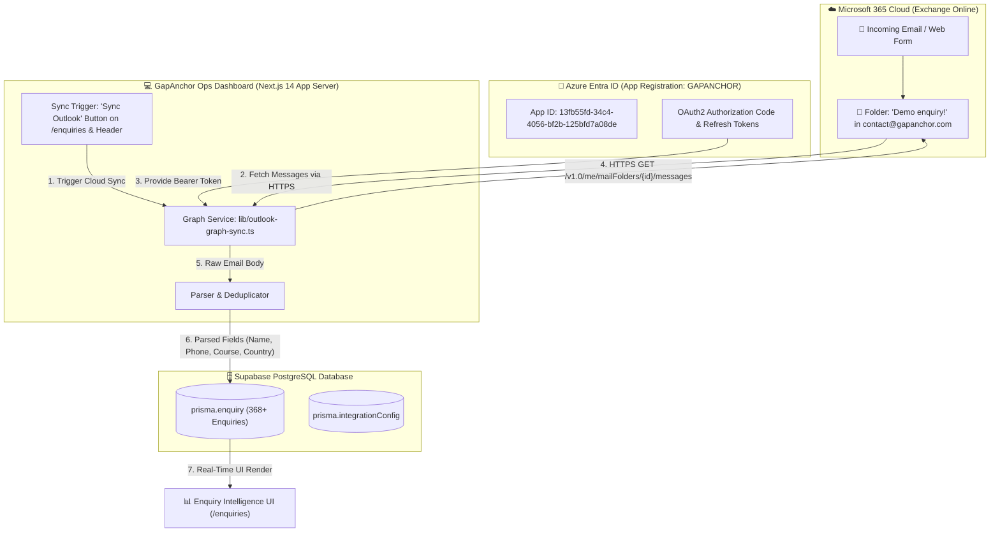
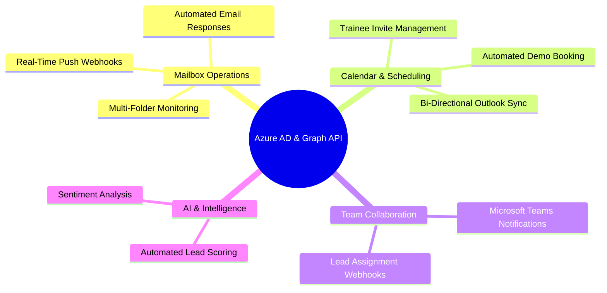

# 🌐 Cloud Microsoft Graph API Architecture & System Flow

> **Target Mailbox**: `contact@gapanchor.com`  
> **Target Folder**: `Demo enquiry!` (368+ records)  
> **Auth Provider**: Microsoft Entra ID (Azure AD OAuth2)  
> **Graph API Endpoint**: `https://graph.microsoft.com/v1.0/`  
> **Last Updated**: Real-Time Dynamic Architecture Document  

---

## 1. Executive Summary & Flow Architecture

Your GapAnchor Ops Dashboard operates **100% natively in the cloud** using Microsoft Graph API for `contact@gapanchor.com`. **Local desktop Python scripts and local Excel fallbacks have been completely decommissioned.**



---

## 2. Step-by-Step Data Flow: How Enquiries Are Extracted

When an enquiry email arrives or when a manual/automated sync is triggered:

### Step 1: Mail Arrival in Microsoft 365 Cloud
Enquiries from your website form or direct inquiries land directly in the `Demo enquiry!` folder inside `contact@gapanchor.com` on Exchange Online servers.

### Step 2: Cloud Authentication & Token Refresh
`lib/outlook-graph-sync.ts` retrieves the encrypted OAuth2 refresh token from `prisma.integrationConfig`.
If the access token is near expiration, the server automatically calls:
`POST https://login.microsoftonline.com/common/oauth2/v2.0/token`
and receives a fresh 60-minute Microsoft Graph Access Token without requiring manual login.

### Step 3: Microsoft Graph API Query
The app sends an authenticated HTTPS request directly to Microsoft Graph API:
```http
GET https://graph.microsoft.com/v1.0/me/mailFolders/{folder_id}/messages?$select=id,subject,from,receivedDateTime,bodyPreview,body&$orderby=receivedDateTime desc&$top=500
Authorization: Bearer <access_token>
```

### Step 4: Intelligent Regex & Field Extraction
The server parses the HTML/plain text email body using structured regex rules:
- **Participant Name**: Extracted from `Name: <val>` or email sender name.
- **Email Address**: Extracted from `Email: <val>` or `from.emailAddress.address`.
- **Phone Number**: Extracted from `Phone: <val>`.
- **Training Course**: Normalized into standard courses (`Manhattan WMS`, `Manhattan ProActive`, `Manhattan Active Transportation`, `Blue Yonder WMS (JDA)`, `Kinaxis`, `SAP S/4HANA`).
- **Country**: Auto-detected via phone country code (+91 → India, +1 → USA, +44 → UK, +971 → UAE) or geocoder text.

### Step 5: Database Deduplication & Upsert
Before saving, `lib/outlook-graph-sync.ts` checks existing records in Supabase PostgreSQL:
- Matches by **Email**, **Participant Name**, or **Phone Number**.
- Checks if the topic & arrival date fall within a **24-hour window**.
- If match found → Updates existing lead timestamp & message ID.
- If new lead → Inserts new `prisma.enquiry` row with status `Open`.

### Step 6: Real-Time UI Update
The Enquiry Intelligence dashboard (`/enquiries`) fetches the updated database records and renders the leads with status badges, search/filter options, and assignment controls.

---

## 3. Futuristic Capabilities Unlocked by Azure AD Integration

Now that your dashboard has direct, authorized access to Microsoft Graph API for `contact@gapanchor.com`, you can expand the platform with the following advanced cloud capabilities:



### 🧠 A. Real-Time Push Webhooks (Zero Polling Needed)
- **Current**: App fetches emails on-demand or via background cron.
- **Next Level**: Subscribe to Graph API Push Notifications (`POST /v1.0/subscriptions`).
- **Benefit**: The instant a new email hits `contact@gapanchor.com`, Microsoft Graph fires a webhook directly to your server, updating your dashboard within **< 2 seconds**!

### 📧 B. Automated Email Replies & Auto-Quotes
- **Capability**: Use Graph API `POST /v1.0/me/sendMail`.
- **Use Case**: When a high-quality lead arrives for *Manhattan ProActive* or *Blue Yonder WMS*, the dashboard can automatically send a personalized response email from `contact@gapanchor.com` containing course brochures, pricing details, and available training slots.

### 📅 C. Bi-Directional Outlook & Teams Calendar Sync
- **Capability**: Access `/v1.0/me/events` and `/v1.0/me/calendarView`.
- **Use Case**:
  - Automatically create calendar events for training sessions when assigned.
  - Generate Teams video call links directly inside the Ops Dashboard.
  - Prevent double-booking by syncing trainer schedules across Outlook & Google Calendar.

### 📁 D. Multi-Folder & Mailbox Automation
- **Capability**: Query any folder in `contact@gapanchor.com` (`Inbox`, `Job Support`, `Invoices`, `Sent Items`, `Spam/Junk`).
- **Use Case**: Monitor job support requests, invoice payment confirmations, or client feedback emails automatically.

---

## 4. Bypassed Legacy Scripts Summary

| Feature | Legacy Local Script | Current Azure Graph Cloud Architecture |
| :--- | :--- | :--- |
| **Execution** | Required local Windows Desktop Outlook & Python COM | Runs 100% on Next.js Server via HTTPS |
| **Authentication** | Local Windows MAPI Session | Secure OAuth2 Bearer Tokens via Azure AD |
| **Dependency** | Desktop PC must stay turned on | Server runs 24/7 in Cloud / Vercel / Supabase |
| **Speed & Reliability** | High failure risk if Outlook app closes | Instant HTTPS Graph API query with auto-refresh |
| **Scalability** | Single local machine only | Multi-user, multi-tenant enterprise architecture |
